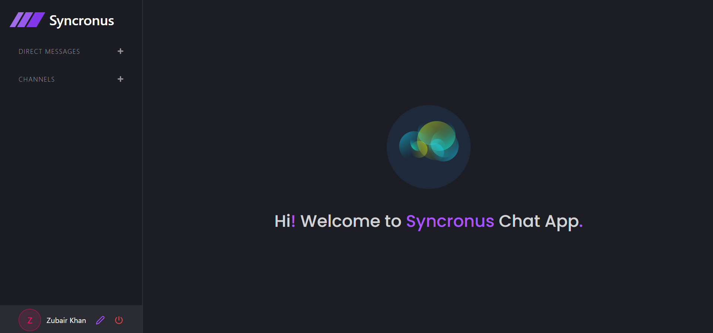
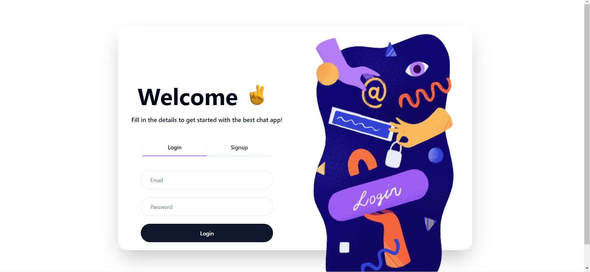
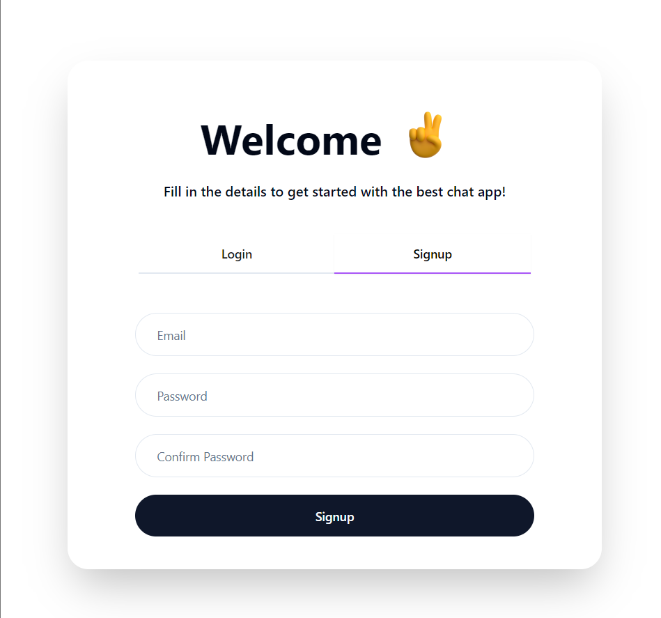
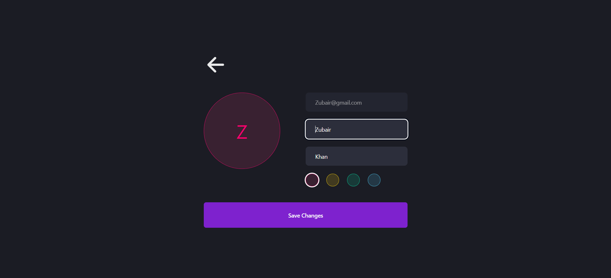
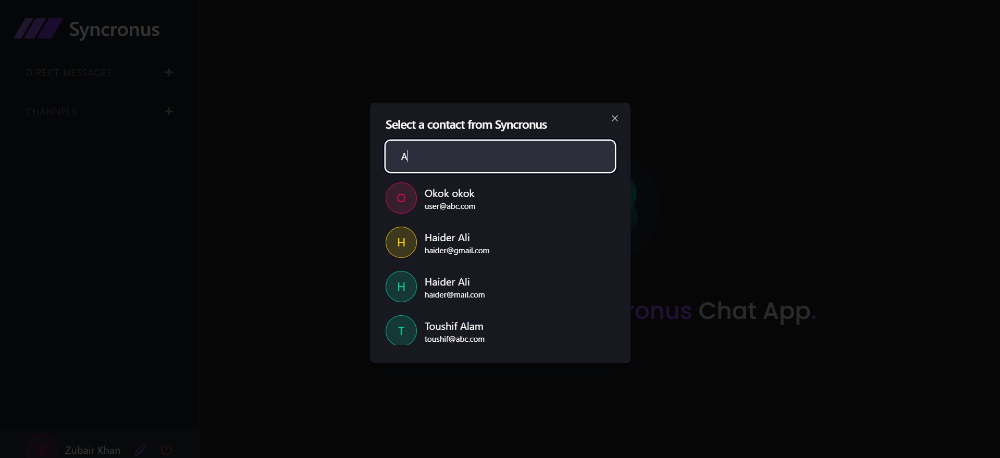
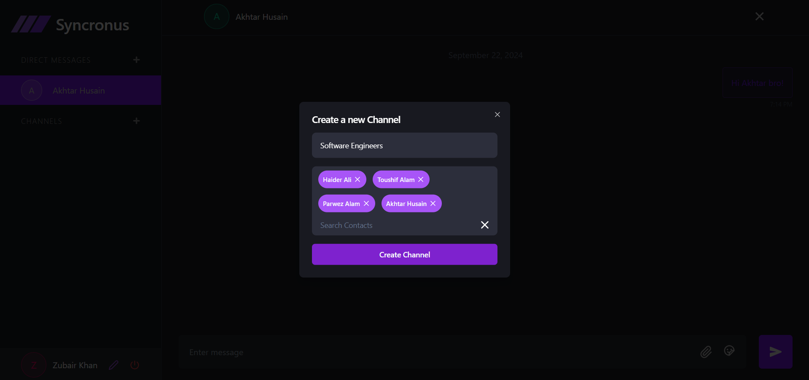
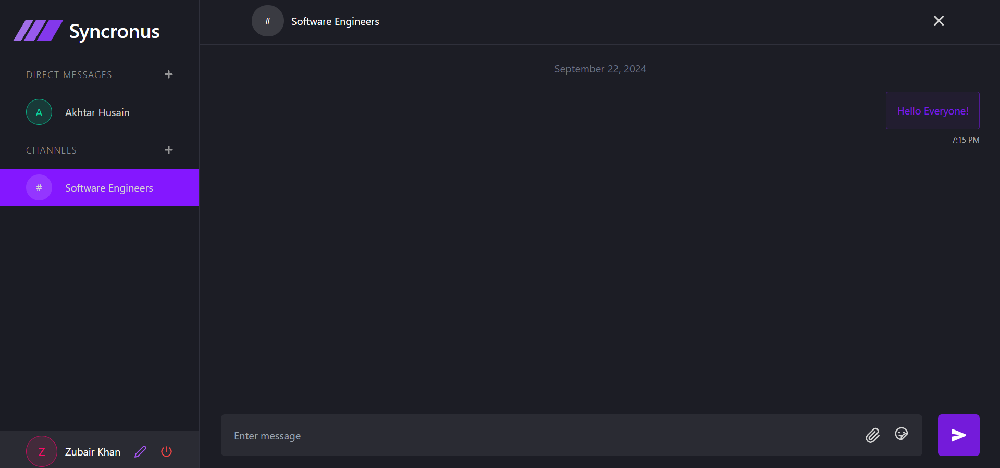
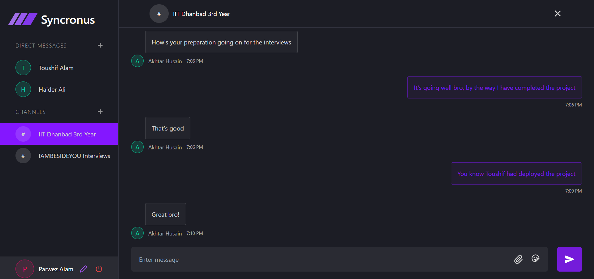

# Personal Information

** Name: Haider Ali **

** University: IIT Dhanbad **

** Departemnt: Mineral And Metallurgical Engineering **


# System Design Document: Syncronus-chat-app

### 1. Overview
Syncronus-chat-app is a full-stack real-time messaging application that enables users to communicate through one-to-one chats, group chats, and notifications. The system employs Socket.io for real-time communication, ensuring low-latency interactions. User data and messages are securely stored in a MongoDB database.

### 2. Requirements

#### 2.1 Functional Requirements
1. **User Authentication**
   - Secure registration and login using JWT (JSON Web Token) authentication.
   - Password encryption (using bcrypt) to protect user credentials.
   
2. **Real-Time Messaging**
   - One-to-one chats with other users.
   - Group chats with multiple users.
   - Typing indicators to show when a user is typing.
   
3. **Search Users**
   - Functionality to search for users by name or username to initiate a chat.
   
4. **Notifications**
   - Real-time notifications for new messages.
   
5. **Manage Groups**
   - Create groups, add or remove members from group chats.
   
6. **View User Profiles**
   - View profiles of users within the app, including profile pictures and statuses.

7. **Admin Functionality**
   - Group admin can add/remove users from a group.

#### 2.2 Non-Functional Requirements
1. **Scalability**
   - Must support a large number of concurrent users.
   
2. **Availability**
   - High availability with minimal downtime (99.9% uptime).
   
3. **Security**
   - Data encryption for sensitive information like passwords.
   - Secure WebSocket communication.
   
4. **Low Latency**
   - Real-time messaging should have sub-second latency.
   
5. **Reliability**
   - Ensure data consistency, particularly for message delivery.
   
6. **Data Retention**
   - Persist chat history for future reference.

### 3. System Architecture

#### 3.1 High-Level Architecture

- **Client (Frontend):** Built using **React.js**
  - Handles user interface, authentication, and real-time chat functionality.
  - Interacts with the backend through REST APIs and WebSockets (Socket.io).

- **API Gateway:** Built using **Node.js + Express.js**
  - Routes client requests to the appropriate services.
  - Handles authentication, authorization, and API request validation.

- **WebSocket Service:** Built with **Socket.io**
  - Maintains real-time communication between the client and server.
  - Handles event-driven messages for individual and group chats.
  - Delivers typing indicators and real-time notifications.

- **Authentication Service:** JWT-based authentication
  - Validates user sessions and secures endpoints.
  - Manages token issuance during user login and registration.

- **Database:** **MongoDB**
  - Stores user information, messages, chat histories, and group information.
  - Uses collections for users, chat rooms (groups), and message logs.

- **Notification Service:** WebSocket-based or Push Notifications
  - Sends real-time notifications for message delivery, typing indicators, and group activities.

- **Load Balancer:** **NGINX or HAProxy**
  - Distributes incoming traffic evenly across multiple instances of the backend server to ensure high availability.

### 4. Detailed Design

#### 4.1 Database Schema

- **Users Collection**
   ```json
   {
     "_id": "ObjectId",
     "username": "string",
     "email": "string",
     "password": "string (encrypted)",
     "profilePicture": "string (URL)",
     "status": "string",
     "createdAt": "timestamp",
     "updatedAt": "timestamp"
   }
   ```
### 4. Detailed Design

#### 4.1 Database Schema

- **Messages Collection**
   ```json
   {
     "_id": "ObjectId",
     "senderId": "ObjectId (ref to Users)",
     "receiverId": "ObjectId (ref to Users or Groups)",
     "message": "string",
     "timestamp": "timestamp",
     "isRead": "boolean"
   }
   ```
### 5. Scalability Considerations

#### 5.1 Horizontal Scaling
The application is designed to scale horizontally by adding more instances of the WebSocket service and API services. Load balancing is handled by NGINX, and each instance will manage a portion of the traffic.

#### 5.2 Database Sharding
MongoDB's horizontal scaling capabilities through sharding can be utilized to partition the data into smaller, more manageable chunks, distributed across different servers.

#### 5.3 Caching
To improve read performance, particularly for frequently accessed data like user profiles or chat history, a caching layer such as Redis can be used.

### 6. Security Considerations

- **JWT Authentication:** All API routes are protected using JWT tokens, ensuring that only authenticated users can access or send data.
- **Password Encryption:** User passwords are hashed and stored securely using bcrypt.
- **Secure WebSocket Connections:** Use SSL/TLS for WebSocket connections to prevent Man-in-the-Middle (MITM) attacks.
- **Role-based Access Control (RBAC):** Implement different access controls for group admins, users, etc., to ensure only authorized users can add/remove members from a group.

### 7. Future Enhancements

- **File Sharing:** Extend the messaging functionality to support sending files, images, and videos.
- **Video/Voice Calling:** Incorporate WebRTC to allow video and voice calls.
- **Message Reactions:** Allow users to react to specific messages with emojis.
- **Presence Indicator:** Show if a user is online or offline in real-time.


   

# Syncronus-chat-app

Syncronus-chat-app is a Full Stack Chatting App that uses Socket.io for real-time communication and stores user details in encrypted format in a MongoDB database.

## Tech Stack

- **Client:** React JS
- **Server:** Node JS, Express JS
- **Database:** MongoDB

## Demo



## Run Locally

### Clone the project

```bash
git clone https://github.com/haiderali2512/Syncronus-Chat-App
```

### Go to the project Directory
```bash
cd Syncronus-chat-app
```

###Install Dpendencies
```bash
cd client
npm install
cd ../server
npm install
```

### Start the Server
```bash
cd server
npm start
```

### Start the Client
```bash
cd client
npm run dev
```


## Features

- **Authentication**
- 
  

  

  

  Secure user authentication and registration.

- **Search Users**
- 
  
  
  Easily search for users to start new conversations.

- **Create Group Chats**
  
  

  

  
  
  Create and manage group conversations.

  
## Made By

[**@Haider**](https://github.com/haiderali2512)
